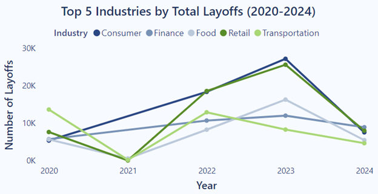
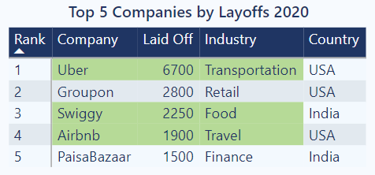
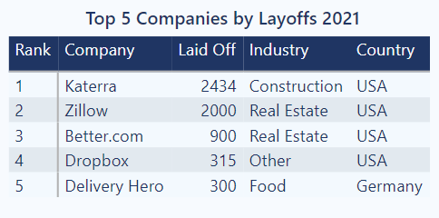
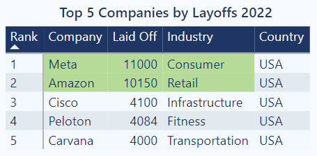
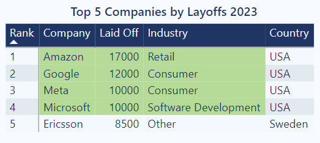
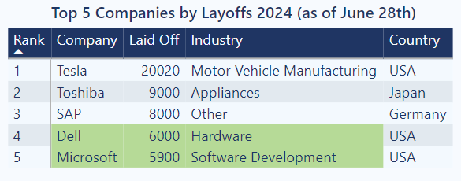
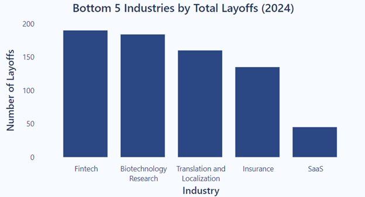

# Global Tech Layoff Analysis (2020-2024)

## Project Overview
The COVID-19 pandemic significantly shifted customer demand, particularly toward remote work and digital services. This project explores how the pandemic impacted various tech sectors and how companies restructured their workforces in response to these changes and subsequent demand stabilization. It aims to provide HR and business leaders with data-driven insights for workforce planning, investment in emerging and resilient sectors, and mitigating risks during future economic uncertainties.

## Executive Summary

## Insight Deep Dive

### Industry Layoff Trends 2020-2024: Pandemic and Post-Pandemic 
  
* **Transportation**:
  - Layoffs in **Transportation** driven by **travel restrictions** recorded *13,600 in 2020*, making it the **industry with the most layoffs** that year.
  - The number remained significant in *2022* with *12,870* but **decreased** to *8,268* in *2023* as the **post-pandemic recovery** began.
  - Most affected companies: **Uber** (*6,700* layoffs in *2020*), and **Airbnb** (*1,900* layoffs in *2020*)
  
* **Retail**:
   - Layoffs in **Retail** recorded *7,615 in 2020* due to **physical store closures** and **rising demand for e-commerce** during the pandemic. 
   - As the **demand started to plateau**, layoffs **surged** to *18,528 (140% compared to 2020) in 2022*, followed by a *25,535 (230%)* increase in *2023*.
   - Most affected company: **Amazon** (*10,150* layoffs  in *2022*; *17,000* layoffs in *2023*)

* **Consumer**:
  - The layoffs in **Consumer** followed a **similar pattern to Retail** due to the shift in demand toward **online services** and subsequent **demand stabilization**. 
  - The number started at *5,341 in 2020* and surged to *18,350 in 2022* and to *27,110 in 2023*.
  - Most affected companies: **Meta** (*11,000* layoffs in *2022*; *10,000* in *2023*), and **Google** (*12,000* layoffs in *2023*)

* **Food**:
  - The **Food** industry recorded *5,629* layoffs in *2020* driven by cost reductions and gathering ristrictions.
  - Layoffs surged to *16,252 in 2023* as companies **downsized after overexpansion** during the peak of the pandemic when demand for online food delivery was at its highest.
  -  Most affected companies:**Swiggy** (*2,250* layoffs in *2020*), and **Delivery Hero** (*300* layoffs in *2021*)

* **Finance**:
  - The recorded layoffs in **Finance** rose to *10,663 (87% compared to 2020) in 2022* due to **ongoing economic downturns** and the increasing replacement of jobs through **automation**.

* **Construction and Real Estate**:
  - The **top 3 companies** with the **most layoffs** recorded in *2021* are in Construction and Real Estate due to the disrupted construction supply chain and **shift to remote work**.
  -  Most affected companies:**Katerra** (*2,434* layoffs in *2021*), **Zillow** (*2,000* layoffs in *2021*), and **Better.com** (*900* layoffs in *2021*)

  

  
  
  
  
  

  

### Emerging Industries with Lowest Layoffs (2024, as of June 28th)

* **Tech**:
  - With the rapid **digital transformation** since pandemic, **SaaS** (*45* layoffs) and **Fintech** (*190*) thrived with increased adoption of remote work, digital banking, and financial innovations, reflecting their emergence as **high-growth sectors**.
  - The recorded layoffs from **Dell** (*6,000*) and **Microsoft** (*5,900*) in 2024 as of June 28th reflect workforce adjustments as both companies pivot toward **cloud computing** and **enterprise solutions**, responding to a **decline** in **PC** demand and slower growth in **traditional software products** post-pandemic.

* **Insurance** and **Biotechnology Research**: 
  - Both industries recorded **low number** of layoffs of *135* and *184*, respectively, in *2024* due to **steady demand** for **risk management** and growing investments in **healthcare innovation** during and after the pandemic.
  
* **Translation and Localization**: 
  - With **160** layoffs recorded in **2024**, this sector benefited from globalization and the growing demand for **cross-border communication** in the **post-pandemic** world.
  

  

### Stock Price and Layoffs

* **Healthcare** and **insurance**:
  - The stock prices of **Johnson & Johnson** (Healthcare) and **Berkshire Hathaway Inc.** (Insurance) **gradually increased** from *109.86 USD* and *175.97 USD* on January 1, 2020, to *143.55 USD* and *407.95 USD* on June 27, 2024, respectively, with **no significant drops** in between.
  - **Healthcare** and **insurance** had the **lowest layoffs** recorded in the dataset, and the **stable increase in stock prices** of major companies in these industries suggests their **resilience** and **stability** during challenging times.

