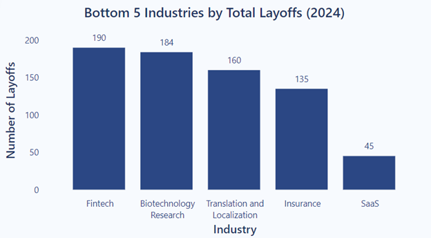

# Tech Layoff Analysis (2020-2024)

## Project Overview
The COVID-19 pandemic significantly shifted customer demand, particularly toward remote work and digital services. This project explores how the pandemic impacted various tech sectors and how companies restructured their workforces in response to these changes and subsequent demand stabilization. It aims to provide HR and business leaders with data-driven insights for workforce planning, investment in emerging and resilient sectors, and mitigating risks during future economic uncertainties.

## Executive Summary
The analysis of industry layoffs and stock market data from 2020 to 2024 highlights how companies navigated the challenges of the pandemic. The transportation sector faced the highest layoffs in 2020, with 13,600, followed by significant layoffs in the retail and consumer industries in 2022 and 2023—25,535 and 27,110, respectively—after demand plateaued. Large-scale layoffs from companies like Meta (11,000 layoffs in 2022) and Amazon (17,000 layoffs in 2023) reflect these demand trends and the significant drop in stock prices across different industries during those years, following a peak in 2021. In contrast, resilient sectors like healthcare and insurance experienced low layoffs and stable stock prices, with companies like Berkshire Hathaway and Johnson & Johnson maintaining gradual growth. The successful stock price recovery of companies like Amazon and Meta, which pivoted to cloud services and customer experience, highlights the importance of adaptability in navigating future uncertainties.

## Data Overview
* **Tech Layoffs**
  - The dataset contains information about layoffs at technology-driven companies from March 12, 2020 (the start of the COVID-19 pandemic), to June 28, 2024. It includes details such as the size and date of layoffs, company information, and industry.
  - The data was analyzed to examine how external factors, such as the pandemic and shifting customer demands, influenced workforce trends across various industries over time, highlighting both emerging and resilient sectors.

* **Stock**
  - The dataset includes closing stock prices of notable companies or those from significant industries identified in the Tech Layoffs dataset, covering the period from March 12, 2020, to June 27, 2024.
  -  It was used to analyze the relationship between layoffs and stock performance and to explore how these companies successfully adapted to changing customer demands or emerging industry trends.
 

  

  
## Insight Deep Dive

### Industry Layoff Trends 2020-2024 Pandemic and Post-Pandemic 
* **Transportation**
  - Layoffs in Transportation driven by travel restrictions recorded 13,600 in 2020, making it the industry with the most layoffs that year.
  - Most affected companies Uber (6,700 layoffs in 2020), and Airbnb (1,900 layoffs in 2020)
  
* **Retail**
   - Layoffs in Retail recorded 7,615 in 2020 due to physical store closures and rising demand for e-commerce during the pandemic. 
   - As the demand started to plateau, layoffs surged to 18,528 (140% compared to 2020) in 2022, followed by a 25,535 (230%) increase in 2023.
   - Most affected company **Amazon** (10,150 layoffs  in 2022; 17,000 layoffs in 2023)

* **Consumer**
  - The layoffs in Consumer followed a similar pattern to Retail due to the shift in demand toward online services and subsequent demand stabilization. 
  - The number started at 5,341 in 2020 and surged to 18,350 in 2022 and to 27,110 in 2023.
  - Most affected companies **Meta** (11,000 layoffs in 2022; 10,000 in 2023), and Google (12,000 layoffs in 2023)

* **Finance**
  - The recorded layoffs in Finance rose to 10,663 (87% compared to 2020) in 2022 due to ongoing economic downturns and the increasing replacement of jobs through automation.

* **Construction and Real Estate**
  - The top 3 companies with the most layoffs recorded in 2021 are in Construction and Real Estate due to the disrupted construction supply chain and shift to remote work.
  -  Most affected companiesKaterra (2,434 layoffs in 2021), Zillow (2,000 layoffs in 2021), and Better.com (900 layoffs in 2021)

  

  
  
  
  
  

  

### Emerging Industries with Lowest Layoffs (2024, as of June 28th)

* **Tech**
  - With the rapid digital transformation since pandemic, SaaS (45 layoffs) and Fintech (190) thrived with increased adoption of remote work, digital banking, and financial innovations, reflecting their emergence as high-growth sectors.
  - The recorded layoffs from Dell (6,000) and Microsoft (5,900) in 2024 as of June 28th reflect workforce adjustments as both companies pivot toward cloud computing and enterprise solutions, responding to a decline in PC demand and slower growth in traditional software products post-pandemic.

* **Insurance and Biotechnology Research**
  - Both industries recorded low number of layoffs of 135 and 184, respectively, in 2024 due to steady demand for risk management and growing investments in healthcare innovation during and after the pandemic.
  
* **Translation and Localization**
  - With 160 layoffs recorded in 2024, this sector benefited from globalization and the growing demand for cross-border communication in the post-pandemic world.
  

  

### Stock Price and Layoffs

* **Biotechnology Research and Insurance**
  - The stock prices of Johnson & Johnson(Biotechnology Research) and Berkshire Hathaway Inc.(Insurance) gradually increased from March 12 , 2020 to June 27, 2024 with no significant drops in between (values highlighted in green in the table below).
  - Biotechnology Research and insurance had the lowest layoffs recorded in the dataset, and the stable increase in stock prices of major companies in these industries suggests their resilience and stability during challenging times.

* **Retail, Consumer, Software Development and Fintech**
   - The stock prices of Amazon(Retail), Meta(Consumer), Microsoft(Software Development) and Intuit(Fintech) peaked around late 2021 and early 2022, then rapidly decreased before beginning to recover in 2023 (values highlighted in yellow in the table below)
   - The large-scale layoffs at Meta and Amazon in 2022 and 2023 discussed in a previous section (Industry Layoff Trends 2020-2024 Pandemic and Post-Pandemic) correspond to two periods after their stock prices decreased rapidly and when they just started recovering.
  

  
  

## Suggestions

* **Form Strategic Partnerships and Investments in High-Growth and Resilient Sectors**
  - Build partnerships with high-growth sectors such as **cloud services, fintech**, and resilient industries like **healthcare and insurance** to diversify revenue streams and create a buffer against future demand plateaus.

* **Support Internal Mobility and Career Development**
  - Provide opportunities for internal mobility, enabling employees to pivot into new roles aligned with emerging fields like cloud services, fintech or customer servicing.

* **Use Predictive Analytics and Scenario Planning**
  - Utilize predictive analytics and scenario planning to anticipate market shifts, allowing companies to adjust their workforce strategy and explore new growth areas before demand plateaus.
