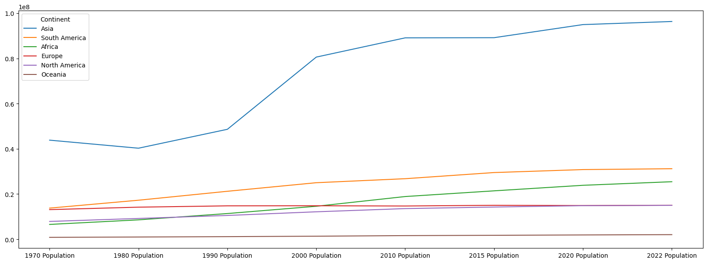

<br/><br/>
A dataset that contains the world population of 234 countries was analyzed and visualized using pandas. 
The dataset contains country name and code, capital, continent and populations (1970, 1980, 1990, 2000, 2010, 2015, 2020 and 2022), rank by population, area, population density, growth rate and world population percentage.
The dataset can be found on <a href="https://www.kaggle.com/datasets/iamsouravbanerjee/world-population-dataset">Kaggle</a>
<br/>

```python
import pandas as pd
import seaborn as sns
import matplotlib.pyplot as plt
```
```python
df = pd.read_csv(r"C:\Users\Nahye\OneDrive - University of Toronto\Documents\Alex Analyst\Python_Pandas\world_population.csv")
df
```


<table border="1" class="dataframe">
  <thead>
    <tr style="text-align: right;">
      <th></th>
      <th>Rank</th>
      <th>CCA3</th>
      <th>Country</th>
      <th>Capital</th>
      <th>Continent</th>
      <th>2022 Population</th>
      <th>2020 Population</th>
      <th>2015 Population</th>
      <th>2010 Population</th>
      <th>2000 Population</th>
      <th>1990 Population</th>
      <th>1980 Population</th>
      <th>1970 Population</th>
      <th>Area (km²)</th>
      <th>Density (per km²)</th>
      <th>Growth Rate</th>
      <th>World Population Percentage</th>
    </tr>
  </thead>
  <tbody>
    <tr>
      <th>0</th>
      <td>36</td>
      <td>AFG</td>
      <td>Afghanistan</td>
      <td>Kabul</td>
      <td>Asia</td>
      <td>41128771.0</td>
      <td>38972230.0</td>
      <td>33753499.0</td>
      <td>28189672.0</td>
      <td>19542982.0</td>
      <td>10694796.0</td>
      <td>12486631.0</td>
      <td>10752971.0</td>
      <td>652230.0</td>
      <td>63.0587</td>
      <td>1.0257</td>
      <td>0.52</td>
    </tr>
    <tr>
      <th>1</th>
      <td>138</td>
      <td>ALB</td>
      <td>Albania</td>
      <td>Tirana</td>
      <td>Europe</td>
      <td>2842321.0</td>
      <td>2866849.0</td>
      <td>2882481.0</td>
      <td>2913399.0</td>
      <td>3182021.0</td>
      <td>3295066.0</td>
      <td>2941651.0</td>
      <td>2324731.0</td>
      <td>28748.0</td>
      <td>98.8702</td>
      <td>0.9957</td>
      <td>0.04</td>
    </tr>
    <tr>
      <th>2</th>
      <td>34</td>
      <td>DZA</td>
      <td>Algeria</td>
      <td>Algiers</td>
      <td>Africa</td>
      <td>44903225.0</td>
      <td>43451666.0</td>
      <td>39543154.0</td>
      <td>35856344.0</td>
      <td>30774621.0</td>
      <td>25518074.0</td>
      <td>18739378.0</td>
      <td>13795915.0</td>
      <td>2381741.0</td>
      <td>18.8531</td>
      <td>1.0164</td>
      <td>0.56</td>
    </tr>
    <tr>
      <th>3</th>
      <td>213</td>
      <td>ASM</td>
      <td>American Samoa</td>
      <td>Pago Pago</td>
      <td>Oceania</td>
      <td>44273.0</td>
      <td>46189.0</td>
      <td>51368.0</td>
      <td>54849.0</td>
      <td>58230.0</td>
      <td>47818.0</td>
      <td>32886.0</td>
      <td>27075.0</td>
      <td>199.0</td>
      <td>222.4774</td>
      <td>0.9831</td>
      <td>0.00</td>
    </tr>
    <tr>
      <th>4</th>
      <td>203</td>
      <td>AND</td>
      <td>Andorra</td>
      <td>Andorra la Vella</td>
      <td>Europe</td>
      <td>79824.0</td>
      <td>77700.0</td>
      <td>71746.0</td>
      <td>71519.0</td>
      <td>66097.0</td>
      <td>53569.0</td>
      <td>35611.0</td>
      <td>19860.0</td>
      <td>468.0</td>
      <td>170.5641</td>
      <td>1.0100</td>
      <td>0.00</td>
    </tr>
    <tr>
      <th>...</th>
      <td>...</td>
      <td>...</td>
      <td>...</td>
      <td>...</td>
      <td>...</td>
      <td>...</td>
      <td>...</td>
      <td>...</td>
      <td>...</td>
      <td>...</td>
      <td>...</td>
      <td>...</td>
      <td>...</td>
      <td>...</td>
      <td>...</td>
      <td>...</td>
      <td>...</td>
    </tr>
    <tr>
      <th>229</th>
      <td>226</td>
      <td>WLF</td>
      <td>Wallis and Futuna</td>
      <td>Mata-Utu</td>
      <td>Oceania</td>
      <td>11572.0</td>
      <td>11655.0</td>
      <td>12182.0</td>
      <td>13142.0</td>
      <td>14723.0</td>
      <td>13454.0</td>
      <td>11315.0</td>
      <td>9377.0</td>
      <td>142.0</td>
      <td>81.4930</td>
      <td>0.9953</td>
      <td>0.00</td>
    </tr>
    <tr>
      <th>230</th>
      <td>172</td>
      <td>ESH</td>
      <td>Western Sahara</td>
      <td>El Aaiún</td>
      <td>Africa</td>
      <td>575986.0</td>
      <td>556048.0</td>
      <td>491824.0</td>
      <td>413296.0</td>
      <td>270375.0</td>
      <td>178529.0</td>
      <td>116775.0</td>
      <td>76371.0</td>
      <td>266000.0</td>
      <td>2.1654</td>
      <td>1.0184</td>
      <td>0.01</td>
    </tr>
    <tr>
      <th>231</th>
      <td>46</td>
      <td>YEM</td>
      <td>Yemen</td>
      <td>Sanaa</td>
      <td>Asia</td>
      <td>33696614.0</td>
      <td>32284046.0</td>
      <td>28516545.0</td>
      <td>24743946.0</td>
      <td>18628700.0</td>
      <td>13375121.0</td>
      <td>9204938.0</td>
      <td>6843607.0</td>
      <td>527968.0</td>
      <td>63.8232</td>
      <td>1.0217</td>
      <td>0.42</td>
    </tr>
    <tr>
      <th>232</th>
      <td>63</td>
      <td>ZMB</td>
      <td>Zambia</td>
      <td>Lusaka</td>
      <td>Africa</td>
      <td>20017675.0</td>
      <td>18927715.0</td>
      <td>NaN</td>
      <td>13792086.0</td>
      <td>9891136.0</td>
      <td>7686401.0</td>
      <td>5720438.0</td>
      <td>4281671.0</td>
      <td>752612.0</td>
      <td>26.5976</td>
      <td>1.0280</td>
      <td>0.25</td>
    </tr>
    <tr>
      <th>233</th>
      <td>74</td>
      <td>ZWE</td>
      <td>Zimbabwe</td>
      <td>Harare</td>
      <td>Africa</td>
      <td>16320537.0</td>
      <td>15669666.0</td>
      <td>14154937.0</td>
      <td>12839771.0</td>
      <td>11834676.0</td>
      <td>10113893.0</td>
      <td>7049926.0</td>
      <td>5202918.0</td>
      <td>390757.0</td>
      <td>41.7665</td>
      <td>1.0204</td>
      <td>0.20</td>
    </tr>
  </tbody>
</table>
<p>234 rows × 17 columns</p>
</div>


<br/><br/>
There are only a few missing values across some columns, with the dataset being mostly complete. The majority of columns have minor gaps in data, while key columns like Rank, Country, and Continent contain no missing values.
<br/>

```python
# Get the info of df
# # of cols, non-null entries and data type of each col
df.info()
```

    <class 'pandas.core.frame.DataFrame'>
    RangeIndex: 234 entries, 0 to 233
    Data columns (total 17 columns):
     #   Column                       Non-Null Count  Dtype  
    ---  ------                       --------------  -----  
     0   Rank                         234 non-null    int64  
     1   CCA3                         234 non-null    object 
     2   Country                      234 non-null    object 
     3   Capital                      234 non-null    object 
     4   Continent                    234 non-null    object 
     5   2022 Population              230 non-null    float64
     6   2020 Population              233 non-null    float64
     7   2015 Population              230 non-null    float64
     8   2010 Population              227 non-null    float64
     9   2000 Population              227 non-null    float64
     10  1990 Population              229 non-null    float64
     11  1980 Population              229 non-null    float64
     12  1970 Population              230 non-null    float64
     13  Area (km²)                   232 non-null    float64
     14  Density (per km²)            230 non-null    float64
     15  Growth Rate                  232 non-null    float64
     16  World Population Percentage  234 non-null    float64
    dtypes: float64(12), int64(1), object(4)
    memory usage: 31.2+ KB
    
<br/>

```python
# Number of nulls in each column
df.isnull().sum()
```


    Rank                           0
    CCA3                           0
    Country                        0
    Capital                        0
    Continent                      0
    2022 Population                4
    2020 Population                1
    2015 Population                4
    2010 Population                7
    2000 Population                7
    1990 Population                5
    1980 Population                5
    1970 Population                4
    Area (km²)                     2
    Density (per km²)              4
    Growth Rate                    2
    World Population Percentage    0
    dtype: int64


<br/><br/>
The number of unique values in each column is shown below. The columns Rank, CCA3, Country, and Capital only had unique values and the Continent had 6 different values as they should. The populations in each year recorded, area and area and density were mostly unique with less than 5 non-unique values. However, Growth Rate and World Population Percentage have less unique values than those since those values tend to be small and have small variance.
<br/>

```python
# Number of unique values in each column
df.nunique()
```


    Rank                           234
    CCA3                           234
    Country                        234
    Capital                        234
    Continent                        6
    2022 Population                230
    2020 Population                233
    2015 Population                230
    2010 Population                227
    2000 Population                227
    1990 Population                229
    1980 Population                229
    1970 Population                230
    Area (km²)                     231
    Density (per km²)              230
    Growth Rate                    178
    World Population Percentage     70
    dtype: int64


<br/><br/>
According to the summary statistic of each column, Growth Rate ranged from 0.91 to 1.07 with standard deviation 0.01, which is very small compared to standard deivations of populations that go up to tens or hundreds of million. World Population Percentage ranges from 0.00 to 17.88 with a higher standard deviation of 1.71. However, 25%, 50% and 75% percentile of 0.01, 0.07 and 0.28 indicate that the most countries have a small World Population Percentage below 0.28. The boxplot not only supports those observations but visualizes the distributions of all values in each column.
<br/>

```python
# Format the numbers to two decimal places and place commas every three digits for better legibility.
pd.set_option('display.float_format', lambda x: f"{x:,.2f}")
```


```python
# statistic of each col.
df.describe()
```


<table border="1" class="dataframe">
  <thead>
    <tr style="text-align: right;">
      <th></th>
      <th>Rank</th>
      <th>2022 Population</th>
      <th>2020 Population</th>
      <th>2015 Population</th>
      <th>2010 Population</th>
      <th>2000 Population</th>
      <th>1990 Population</th>
      <th>1980 Population</th>
      <th>1970 Population</th>
      <th>Area (km²)</th>
      <th>Density (per km²)</th>
      <th>Growth Rate</th>
      <th>World Population Percentage</th>
    </tr>
  </thead>
  <tbody>
    <tr>
      <th>count</th>
      <td>234.00</td>
      <td>230.00</td>
      <td>233.00</td>
      <td>230.00</td>
      <td>227.00</td>
      <td>227.00</td>
      <td>229.00</td>
      <td>229.00</td>
      <td>230.00</td>
      <td>232.00</td>
      <td>230.00</td>
      <td>232.00</td>
      <td>234.00</td>
    </tr>
    <tr>
      <th>mean</th>
      <td>117.50</td>
      <td>34,632,250.88</td>
      <td>33,600,710.95</td>
      <td>32,066,004.16</td>
      <td>30,270,164.48</td>
      <td>26,840,495.26</td>
      <td>19,330,463.93</td>
      <td>16,282,884.78</td>
      <td>15,866,499.13</td>
      <td>581,663.75</td>
      <td>456.81</td>
      <td>1.01</td>
      <td>0.43</td>
    </tr>
    <tr>
      <th>std</th>
      <td>67.69</td>
      <td>137,889,172.44</td>
      <td>135,873,196.61</td>
      <td>131,507,146.34</td>
      <td>126,074,183.54</td>
      <td>113,352,454.57</td>
      <td>81,309,624.96</td>
      <td>69,345,465.54</td>
      <td>68,355,859.75</td>
      <td>1,769,133.06</td>
      <td>2,083.74</td>
      <td>0.01</td>
      <td>1.71</td>
    </tr>
    <tr>
      <th>min</th>
      <td>1.00</td>
      <td>510.00</td>
      <td>520.00</td>
      <td>564.00</td>
      <td>596.00</td>
      <td>651.00</td>
      <td>700.00</td>
      <td>733.00</td>
      <td>752.00</td>
      <td>1.00</td>
      <td>0.03</td>
      <td>0.91</td>
      <td>0.00</td>
    </tr>
    <tr>
      <th>25%</th>
      <td>59.25</td>
      <td>419,738.50</td>
      <td>406,471.00</td>
      <td>394,295.00</td>
      <td>382,726.50</td>
      <td>329,470.00</td>
      <td>261,928.00</td>
      <td>223,752.00</td>
      <td>145,880.50</td>
      <td>2,567.25</td>
      <td>36.60</td>
      <td>1.00</td>
      <td>0.01</td>
    </tr>
    <tr>
      <th>50%</th>
      <td>117.50</td>
      <td>5,762,857.00</td>
      <td>5,456,681.00</td>
      <td>5,244,415.00</td>
      <td>4,889,741.00</td>
      <td>4,491,202.00</td>
      <td>3,785,847.00</td>
      <td>3,135,123.00</td>
      <td>2,511,718.00</td>
      <td>77,141.00</td>
      <td>95.35</td>
      <td>1.01</td>
      <td>0.07</td>
    </tr>
    <tr>
      <th>75%</th>
      <td>175.75</td>
      <td>22,653,719.00</td>
      <td>21,522,626.00</td>
      <td>19,730,853.75</td>
      <td>16,825,852.50</td>
      <td>15,625,467.00</td>
      <td>11,882,762.00</td>
      <td>9,817,257.00</td>
      <td>8,817,329.00</td>
      <td>414,643.25</td>
      <td>236.88</td>
      <td>1.02</td>
      <td>0.28</td>
    </tr>
    <tr>
      <th>max</th>
      <td>234.00</td>
      <td>1,425,887,337.00</td>
      <td>1,424,929,781.00</td>
      <td>1,393,715,448.00</td>
      <td>1,348,191,368.00</td>
      <td>1,264,099,069.00</td>
      <td>1,153,704,252.00</td>
      <td>982,372,466.00</td>
      <td>822,534,450.00</td>
      <td>17,098,242.00</td>
      <td>23,172.27</td>
      <td>1.07</td>
      <td>17.88</td>
    </tr>
  </tbody>
</table>
</div>

<br/>


```python
# Use boxplot to view outliers and distributions
df.boxplot(figsize = (25, 10))
```


    

    

<br/><br/>
The table below shows the 10 countries with the largest population in 2022 with five of them in Asia, 2 in North America 1 each in South America, Africa and Europe. The top two countries, China and India take up 17.88% and 17.77% of the world population, respectively and United States ranked third take up 4.24% which is significantly low compared to the other two. This explains the left-skewed distribution of values in World Population Percentage that was previously mentioned. The the populations of China and India were not significantly different in 2022, and the growht rates were 1.00 adn 1.01 each, which supports many previous research that the populatioh of India will outgrow that of China. According to <a href="https://population.un.org/wpp/">UN</a>, India is indeed the most populous country in the world in 2024.
<br/>

```python
df_2022 = df.sort_values(by = '2022 Population', ascending = False).iloc[0:10]
df_2022[['Rank', 'Country', 'Continent', '2022 Population',  'Growth Rate', 'World Population Percentage']]
# OR
# df.sort_values(by = '2022 Population', ascending = False).head(10)
```


<table border="1" class="dataframe">
  <thead>
    <tr style="text-align: right;">
      <th></th>
      <th>Rank</th>
      <th>CCA3</th>
      <th>Country</th>
      <th>Continent</th>
      <th>2022 Population</th>
      <th>Density (per km²)</th>
      <th>Growth Rate</th>
      <th>World Population Percentage</th>
    </tr>
  </thead>
  <tbody>
    <tr>
      <th>41</th>
      <td>1</td>
      <td>CHN</td>
      <td>China</td>
      <td>Asia</td>
      <td>1,425,887,337.00</td>
      <td>146.89</td>
      <td>1.00</td>
      <td>17.88</td>
    </tr>
    <tr>
      <th>92</th>
      <td>2</td>
      <td>IND</td>
      <td>India</td>
      <td>Asia</td>
      <td>1,417,173,173.00</td>
      <td>431.07</td>
      <td>1.01</td>
      <td>17.77</td>
    </tr>
    <tr>
      <th>221</th>
      <td>3</td>
      <td>USA</td>
      <td>United States</td>
      <td>North America</td>
      <td>338,289,857.00</td>
      <td>36.09</td>
      <td>1.00</td>
      <td>4.24</td>
    </tr>
    <tr>
      <th>93</th>
      <td>4</td>
      <td>IDN</td>
      <td>Indonesia</td>
      <td>Asia</td>
      <td>275,501,339.00</td>
      <td>144.65</td>
      <td>1.01</td>
      <td>3.45</td>
    </tr>
    <tr>
      <th>156</th>
      <td>5</td>
      <td>PAK</td>
      <td>Pakistan</td>
      <td>Asia</td>
      <td>235,824,862.00</td>
      <td>267.40</td>
      <td>1.02</td>
      <td>2.96</td>
    </tr>
    <tr>
      <th>149</th>
      <td>6</td>
      <td>NGA</td>
      <td>Nigeria</td>
      <td>Africa</td>
      <td>218,541,212.00</td>
      <td>236.58</td>
      <td>1.02</td>
      <td>2.74</td>
    </tr>
    <tr>
      <th>27</th>
      <td>7</td>
      <td>BRA</td>
      <td>Brazil</td>
      <td>South America</td>
      <td>215,313,498.00</td>
      <td>25.28</td>
      <td>1.00</td>
      <td>2.70</td>
    </tr>
    <tr>
      <th>16</th>
      <td>8</td>
      <td>BGD</td>
      <td>Bangladesh</td>
      <td>Asia</td>
      <td>171,186,372.00</td>
      <td>1,160.04</td>
      <td>1.01</td>
      <td>2.15</td>
    </tr>
    <tr>
      <th>171</th>
      <td>9</td>
      <td>RUS</td>
      <td>Russia</td>
      <td>Europe</td>
      <td>144,713,314.00</td>
      <td>8.46</td>
      <td>1.00</td>
      <td>1.81</td>
    </tr>
    <tr>
      <th>131</th>
      <td>10</td>
      <td>MEX</td>
      <td>Mexico</td>
      <td>North America</td>
      <td>127,504,125.00</td>
      <td>64.91</td>
      <td>1.01</td>
      <td>1.60</td>
    </tr>
  </tbody>
</table>
</div>


<br/><br/>
The correlation heat map among columns with numeric datatypes show that the change in population of the countries was not statistically significant especially from 2010 to 2022 as the correlations between popualtions recorded in the time frame were all 1. Rank and population columns were negatively correlated as expected since greater the population the higher the ranking. The polulations and growth rate are negatively correlated by small numbers (> -0.01), and this is reasonable considering that the populations of populous countries can saturate over time.
<br/>

```python
# Correlation between all numeric values
num_df = df.select_dtypes(include=['number'])
```


```python
# Visualizae the correlation using heat map
sns.heatmap(num_df.corr(), annot = True)

plt.rcParams['figure.figsize'] = (20, 7)

plt.show()
```


    

    


```python
# Find mean for each column by continent and sort by 2022 mean population from the highest to the lowest.
df2 = df.groupby('Continent')[num_df.columns].mean().sort_values(by = '2022 Population', ascending = False)
df2
```


<table border="1" class="dataframe">
  <thead>
    <tr style="text-align: right;">
      <th></th>
      <th>Rank</th>
      <th>2022 Population</th>
      <th>2020 Population</th>
      <th>2015 Population</th>
      <th>2010 Population</th>
      <th>2000 Population</th>
      <th>1990 Population</th>
      <th>1980 Population</th>
      <th>1970 Population</th>
      <th>Area (km²)</th>
      <th>Density (per km²)</th>
      <th>Growth Rate</th>
      <th>World Population Percentage</th>
    </tr>
    <tr>
      <th>Continent</th>
      <th></th>
      <th></th>
      <th></th>
      <th></th>
      <th></th>
      <th></th>
      <th></th>
      <th></th>
      <th></th>
      <th></th>
      <th></th>
      <th></th>
      <th></th>
    </tr>
  </thead>
  <tbody>
    <tr>
      <th>Asia</th>
      <td>77.56</td>
      <td>96,327,387.31</td>
      <td>94,955,134.37</td>
      <td>89,165,003.64</td>
      <td>89,087,770.00</td>
      <td>80,580,835.11</td>
      <td>48,639,995.33</td>
      <td>40,278,333.33</td>
      <td>43,839,877.83</td>
      <td>642,762.82</td>
      <td>1,025.02</td>
      <td>1.01</td>
      <td>1.18</td>
    </tr>
    <tr>
      <th>South America</th>
      <td>97.57</td>
      <td>31,201,186.29</td>
      <td>30,823,574.50</td>
      <td>29,509,599.71</td>
      <td>26,789,395.54</td>
      <td>25,015,888.69</td>
      <td>21,224,743.93</td>
      <td>17,270,643.29</td>
      <td>13,781,939.71</td>
      <td>1,301,302.85</td>
      <td>20.97</td>
      <td>1.01</td>
      <td>0.39</td>
    </tr>
    <tr>
      <th>Africa</th>
      <td>92.16</td>
      <td>25,455,879.68</td>
      <td>23,871,435.26</td>
      <td>21,419,703.57</td>
      <td>18,898,197.31</td>
      <td>14,598,365.95</td>
      <td>11,376,964.52</td>
      <td>8,586,031.98</td>
      <td>6,567,175.27</td>
      <td>537,879.30</td>
      <td>126.41</td>
      <td>1.02</td>
      <td>0.31</td>
    </tr>
    <tr>
      <th>Europe</th>
      <td>124.50</td>
      <td>15,055,371.82</td>
      <td>14,915,843.92</td>
      <td>15,027,454.12</td>
      <td>14,712,278.68</td>
      <td>14,817,685.71</td>
      <td>14,785,203.94</td>
      <td>14,200,004.52</td>
      <td>13,118,479.82</td>
      <td>460,208.22</td>
      <td>663.32</td>
      <td>1.00</td>
      <td>0.19</td>
    </tr>
    <tr>
      <th>North America</th>
      <td>160.93</td>
      <td>15,007,403.40</td>
      <td>14,855,914.82</td>
      <td>14,259,596.25</td>
      <td>13,568,016.28</td>
      <td>12,151,739.60</td>
      <td>10,531,660.62</td>
      <td>9,207,334.03</td>
      <td>7,885,865.15</td>
      <td>606,104.45</td>
      <td>272.49</td>
      <td>1.00</td>
      <td>0.19</td>
    </tr>
    <tr>
      <th>Oceania</th>
      <td>188.52</td>
      <td>2,046,386.32</td>
      <td>1,910,148.96</td>
      <td>1,756,664.48</td>
      <td>1,613,163.65</td>
      <td>1,357,512.09</td>
      <td>1,162,774.87</td>
      <td>996,532.17</td>
      <td>846,968.26</td>
      <td>370,220.91</td>
      <td>132.54</td>
      <td>1.01</td>
      <td>0.02</td>
    </tr>
  </tbody>
</table>
</div>


```python
df4 = df2.filter(items = ['1970 Population', '1980 Population', '1990 Population',
       '2000 Population', '2010 Population', '2015 Population',
       '2020 Population', '2022 Population'])
df4
```


<table border="1" class="dataframe">
  <thead>
    <tr style="text-align: right;">
      <th></th>
      <th>1970 Population</th>
      <th>1980 Population</th>
      <th>1990 Population</th>
      <th>2000 Population</th>
      <th>2010 Population</th>
      <th>2015 Population</th>
      <th>2020 Population</th>
      <th>2022 Population</th>
    </tr>
    <tr>
      <th>Continent</th>
      <th></th>
      <th></th>
      <th></th>
      <th></th>
      <th></th>
      <th></th>
      <th></th>
      <th></th>
    </tr>
  </thead>
  <tbody>
    <tr>
      <th>Asia</th>
      <td>43,839,877.83</td>
      <td>40,278,333.33</td>
      <td>48,639,995.33</td>
      <td>80,580,835.11</td>
      <td>89,087,770.00</td>
      <td>89,165,003.64</td>
      <td>94,955,134.37</td>
      <td>96,327,387.31</td>
    </tr>
    <tr>
      <th>South America</th>
      <td>13,781,939.71</td>
      <td>17,270,643.29</td>
      <td>21,224,743.93</td>
      <td>25,015,888.69</td>
      <td>26,789,395.54</td>
      <td>29,509,599.71</td>
      <td>30,823,574.50</td>
      <td>31,201,186.29</td>
    </tr>
    <tr>
      <th>Africa</th>
      <td>6,567,175.27</td>
      <td>8,586,031.98</td>
      <td>11,376,964.52</td>
      <td>14,598,365.95</td>
      <td>18,898,197.31</td>
      <td>21,419,703.57</td>
      <td>23,871,435.26</td>
      <td>25,455,879.68</td>
    </tr>
    <tr>
      <th>Europe</th>
      <td>13,118,479.82</td>
      <td>14,200,004.52</td>
      <td>14,785,203.94</td>
      <td>14,817,685.71</td>
      <td>14,712,278.68</td>
      <td>15,027,454.12</td>
      <td>14,915,843.92</td>
      <td>15,055,371.82</td>
    </tr>
    <tr>
      <th>North America</th>
      <td>7,885,865.15</td>
      <td>9,207,334.03</td>
      <td>10,531,660.62</td>
      <td>12,151,739.60</td>
      <td>13,568,016.28</td>
      <td>14,259,596.25</td>
      <td>14,855,914.82</td>
      <td>15,007,403.40</td>
    </tr>
    <tr>
      <th>Oceania</th>
      <td>846,968.26</td>
      <td>996,532.17</td>
      <td>1,162,774.87</td>
      <td>1,357,512.09</td>
      <td>1,613,163.65</td>
      <td>1,756,664.48</td>
      <td>1,910,148.96</td>
      <td>2,046,386.32</td>
    </tr>
  </tbody>
</table>
</div>


<br/><br/>
The graph below represents the average populations of the six continents from 1970 to 2022. Asia and South America has been the two most populous continents and Oceanina has been the least populous throughout the time frame. Asia had a dramatic increase in population from 1990 to 2000, which is likely to be contributed by devleoping countries like China and India. Overall, the population of Asia changed dramatically between each time stamp while five other continents changed more steadily. The population of Africa outgreww North America by 1990 and Europe by 2010, and the increase in population of Africa was possibly contributed by developing countries such as Nigeria which populaiton almost quadrupled from 55 million in 1970 to 218 million in 2022.
<br/>


```python
df4.transpose().plot()
```


    

    

<br/>

```python
df.iloc[149]
```


    Rank                                       6
    CCA3                                     NGA
    Country                              Nigeria
    Capital                                Abuja
    Continent                             Africa
    2022 Population               218,541,212.00
    2020 Population               208,327,405.00
    2015 Population               183,995,785.00
    2010 Population               160,952,853.00
    2000 Population               122,851,984.00
    1990 Population                95,214,257.00
    1980 Population                72,951,439.00
    1970 Population                55,569,264.00
    Area (km²)                        923,768.00
    Density (per km²)                     236.58
    Growth Rate                             1.02
    World Population Percentage             2.74
    Name: 149, dtype: object


